# Data Model

## Major Entity Diagram

```mermaid
erDiagram
    CUSTOM_USER ||--o{ POS_OPENING_ENTRY : opens
    CUSTOM_USER ||--o{ ORDER : settles
    RESTAURANT }o--|| MENU : active_menu
    RESTAURANT }o--|| WAREHOUSE : bar_warehouse
    RESTAURANT }o--|| WAREHOUSE : store_warehouse
    PRODUCTION_UNIT }o--|| WAREHOUSE : uses
    MENU ||--o{ MENU_ITEM : contains
    ITEM ||--o{ MENU_ITEM : priced_as
    ITEM_GROUP ||--o{ ITEM : classifies
    UOM ||--o{ ITEM : measures
    ITEM ||--o{ ITEM_UOM_CONVERSION : converts
    UOM ||--o{ ITEM_UOM_CONVERSION : bulk_unit
    ITEM ||--o{ ITEM_ADD_ON : parent
    ITEM ||--o{ ITEM_ADD_ON : add_on
    POS_OPENING_ENTRY ||--o{ ORDER : owns
    POS_OPENING_ENTRY ||--o{ OPENING_PAYMENT : declares
    POS_OPENING_ENTRY ||--o| POS_CLOSING_ENTRY : closes
    POS_CLOSING_ENTRY ||--o{ CLOSING_PAYMENT : counts
    MODE_OF_PAYMENT ||--o| PAYMENT_GL_MAPPING : maps
    MODE_OF_PAYMENT ||--o{ ORDER_PAYMENT : labels
    ORDER ||--o{ ORDER_ITEM : contains
    ORDER ||--o{ ORDER_PAYMENT : receives
    ORDER ||--o{ KOT : generates
    ORDER ||--o{ ORDER_AUDIT_EVENT : records
    ITEM ||--o{ BIN : stocked_in
    WAREHOUSE ||--o{ BIN : contains
    ITEM ||--o{ STOCK_LEDGER_ENTRY : moves
    WAREHOUSE ||--o{ STOCK_LEDGER_ENTRY : moves
    STOCK_ENTRY ||--o{ STOCK_ENTRY_DETAIL : lines
    STOCK_RECONCILIATION ||--o{ STOCK_RECONCILIATION_ITEM : lines
    PURCHASE_RECEIPT ||--o{ PURCHASE_RECEIPT_ITEM : lines
    DAILY_PNL ||--o{ DAILY_PNL_LINE : statement
    DAILY_PNL ||--o{ DAILY_PNL_MATERIAL_QTY : consumes
    DAILY_PNL ||--o{ DAILY_PNL_AD_HOC : extras
```

## Shared Conventions

Most project domain models extend `apps.utils.models.BaseModel`, adding `created_at` and `updated_at`. `users.CustomUser` instead extends Django's `AbstractUser`. Money and quantities use `DecimalField`. No money field uses `FloatField`.

Money rounding goes through `apps.utils.rounding`. `money()` rounds 2 dp amounts half-even. `cash_round()` rounds whole-naira cash totals half-up. `percent()` rounds percentages to 3 dp half-even.

Foreign keys for historical business documents generally use `PROTECT` or `SET_NULL`. Child rows of draft documents use `CASCADE` where deleting the parent is still allowed.

## Settings and Routing

- `Restaurant`: singleton enforced by `singleton_key` and `clean()`. `load()` returns the first row with active menu and warehouse relations loaded. Since Phase 6 it also carries accounting FKs: `default_income_account`, `default_sales_returns_account`, `default_expense_account`, `round_off_account`, `account_for_change_amount`, `wastage_account`, `cash_shortage_account`, `cash_over_short_account`, and `variance_approval_threshold` (all nullable except where settlement enforces them). The two over/short accounts are enforced at shift close whenever a variance exists. Since Phase 10 it also carries `stock_adjustment_account` (Expense) and `temporary_opening_account` (Equity, balance-sheet only). `require_payment_reference` (Boolean, default off) makes a reference mandatory on non-cash settlement rows. `requires_payment_reference()` reads it without loading the full singleton.
- `ProductionUnit`: one row per department via a unique constraint. Stores station warehouse, takeaway-ticket suppression, and printer metadata. Also stores three GL hooks:
  - `income_account` — the departmental income hook. First stop in income account resolution before the Restaurant default.
  - `sales_returns_account` — the departmental refund hook. Debited on return lines, first stop before the Restaurant default.
  - `expense_account` — the departmental COGS hook. Kitchen consumption and Bar settle-time COGS resolve here first, then the Restaurant default.
- `ItemGroup`: flat category.
- `Warehouse`: flat stock location. Since Phase 6 it carries an optional `account` FK, credited with the stock value of settle-time drink deductions.
- Warehouse role is inferred from references. There is no warehouse type field.

## Product and Menu Entities

- `ItemGroup`: flat category.
- `UOM`: unit of measure. `Item.stock_uom` is the countable unit for bins, the ledger, counts, and POS (Bottle, Kg, Litre, Each, Plate).
- `Item`: item master with independent `is_sales_item`, `is_stock_item`, and `is_purchase_item` flags. `has_variants=True` makes it a non-sellable/non-purchasable template in `Item.save()`. `Item.save()` rejects `stock_uom` changes and stock/purchase switches while conversion rows exist.
- `ItemUOMConversion`: one bulk purchase unit per item (`unique (item, uom)`), converting bulk → stock (`1 Crate = 24 Bottle`). `uom` cannot equal the item's stock UOM. `conversion_factor > 0`. Rows require enabled items with stock and purchase flags. Virtual sellable food cannot carry rows. Once a stock movement exists for the item at or after a row's creation, editing the factor or deleting the row is rejected — historical SLEs hold blended WAC with no link back to the factor, so a used row must stay as-is and a new row carries any change.
- `Menu`: named enabled collection.
- `MenuItem`: priced item on a menu, unique per menu/item, with denormalized name and special/disabled flags.
- `ItemAddOn`: parent/add-on relationship. The add-on price is resolved from the active menu. It is not stored here.
- `ItemVariant`: parent/variant relationship. It is modeled, but no current POS variant selector uses it.

## Stock Entities

- `Bin`: current actual quantity, reserved quantity, valuation rate, and stock value for one item/warehouse pair. Outbound ledger moves may never drive actual below reserved. The same floor blocks document cancellations.
- `StockLedgerEntry`: signed PWAC movement (`quantity`, `unit_rate`, `stock_value_change`). The voucher type/number/detail fields link it back to source documents.
- `StockEntry` and `StockEntryDetail`: receipt or Store-to-Kitchen/Bar transfer. Receipt lines record the `uom` bought in (stock unit or a conversion row) and a snapshotted `conversion_factor`. Submit posts `qty × factor` and blends WAC on the as-bought `amount`, mirroring `PurchaseReceiptItem`. Transfer lines stay in the stock unit and snapshot `source_warehouse` / `target_warehouse` on submit. Cancel reverses those snapshots. `StockEntry.mode_of_payment` records the funding account ("Paid from") for market receipts.
- `StockReconciliation` and `StockReconciliationItem`: adjustment with a `reason`. Reasons: `OPENING_STOCK` (first seeding of a fresh warehouse only). `ADJUSTMENT` (counted quantity up or down). `CONSUMPTION` (end-of-day kitchen count that cannot exceed the bin). `WASTE_DAMAGE` (quantity wasted, posted as a positive delta). The GL legs per reason:
  - Opening: Dr warehouse / Cr temporary opening.
  - Adjustment: Dr stock adjustment / Cr warehouse (inbound reverses).
  - Consumption: Dr Kitchen unit expense (else default expense) / Cr kitchen.
  - Waste: Dr wastage / Cr warehouse.

  `remarks` is optional. Submit/cancel stamp `submitted_by`/`submitted_at` and `cancelled_by`/`cancelled_at`.
- `Recipe` and `RecipeItem`: ingredient card per sellable FOOD item (one active card, unique constraint). Lines carry per-output qty in ingredient `stock_uom` (`unique (recipe, ingredient)`).
- `PurchaseReceipt` and `PurchaseReceiptItem`: supplier goods into the central Store. Each line records the `uom` it was bought in (stock unit or a conversion row) and a snapshotted `conversion_factor`. On submit the ledger quantity is `received_qty × factor`, and the inbound value is the as-bought `amount`. WAC blends on that amount. `last_purchase_rate` is per stock UOM (`amount ÷ stock_qty`).

## Order Entities

- `Order`: one operational sale/return document. It owns totals, status, shift, cashier (the settling user), receipt-printed state, warehouse snapshot, return linkage, and audit history. The `created_by` field stamps the creator at draft creation and drives POS draft ownership. `can_be_accessed_by(user)` allows the creator or Manager/Admin. `open_drafts_for(shift, user)` applies the same rule to querysets.
- `OrderItem`: line snapshot with item name, rate, amount, department, stock flag, menu line, comments, customer index, and optional return source. `not_restockable` applies to return drafts only. When set, the returned stock is not restored and posts wastage.
- `OrderPayment`: payment line inside an order. Positive on sales. Negative refund rows occur only on return orders. The row is protected from edits after the order is submitted or ticketed.
- `KOT`/`KOTItem`: immutable order-to-station snapshots. KOT print status is mutable for dispatch/retry.
- `OrderAuditEvent`: append-only event row. It uses `PROTECT` from the order and refuses update/delete.
- `OrderSequence`: locked counter used for human-facing order numbers.

## Shift and Payment Entities

- `POSOpeningEntry`: global shift parent. Open means `SUBMITTED` with no closing link. Closed means `SUBMITTED` with a closing link. `can_be_closed_by(user)` returns True for the opening cashier or a Manager/Admin.
- `OpeningPayment`: mode-specific opening balance. Saves and deletes are rejected once the parent shift leaves `DRAFT` — opening rows are frozen with the shift.
- `POSClosingEntry`: `save()` rejects any write to a `SUBMITTED` or `CANCELLED` close unless the service sets `_allow_submit` / `_allow_cancel` (the same pattern as `Order` and `JournalEntry`). The cancel path flips the status through its own flag; re-submission of a cancelled close stays impossible. All four shift-document Django-admin registrations are view-only.
- `ClosingPayment`: counted, expected, and difference values per opening mode. Saves and deletes are rejected once the parent close leaves `DRAFT` — a submitted reconciliation cannot be overwritten under the ORM, and the Z-report always matches its variance journal.
- `POSClosingEntry`: one-to-one reconciliation document linked to the opening. Stores shift sales at submit (`bill_count`, `total_quantity`, `net_total`, `grand_total`, `refunded_total` — frozen, never recomputed live). Carries `variance_note` (required beyond the approval threshold) and `variance_journal_entry` (linked JE when the close posts a variance).
- `ShiftCashOut`: mid-shift cash-out voucher (SUBMITTED → CANCELLED, no draft). Submitted rows reduce the mode's expected drawer amount.
- `ModeOfPayment`: enabled payment master with one conditional default.
- `PaymentGLMapping`: one-to-one mode-to-ledger-account mapping (`default_account` is a `LedgerAccount` FK, leaf-only).

## Accounting Entities

- `LedgerAccount`: chart-of-accounts node. Flat FK `parent` tree. Roots declare `account_type` (ASSET/LIABILITY/EQUITY/INCOME/EXPENSE) and children inherit it. `is_group` nodes hold children. Only leaves receive postings. `freeze_account` blocks new postings. `disabled` hides the account. GL rows, journal rows, payment mappings, and configured FKs protect it from deletion (PROTECT).
- `FiscalYear`: enabled years must not overlap. `get_for(date)` returns the enabled year covering a date or raises.
- `GLEntry`: one side of a posting — exactly one non-zero debit/credit. Immutable after creation. `save()` blocks edits except the `is_cancelled` reversal flag. `delete()` raises. `post()` resolves the fiscal year from the posting date.
- `JournalEntry`: manual voucher (JOURNAL/CASH/BANK/OPENING), DRAFT → SUBMITTED → CANCELLED. `submit()` requires balance, unique account rows, and a positive total. OPENING vouchers set `is_opening` and reject a second opening for the same fiscal year. `cancel()` posts mirrored negated GL rows and marks originals cancelled. `amend()` copies a CANCELLED entry into a new DRAFT linked via `amended_from`. Only one amendment per cancelled entry: a cancelled entry that already has an amendment cannot be amended again (its amendment is the next link).
- `JournalEntryAccount`: debit/credit row on a journal entry. One of debit/credit must be non-zero. Leaf accounts only.

## Reports Entities

- `PnLConfiguration`: singleton (`load()` get-or-creates) for business-day start hour, electricity rate, daily depreciation, and whether to include cash variance.
- `PnLMaterial` / `PnLRecurringExpense`: catalogs of consumables and remembered expense templates (daily, monthly ÷ days-in-month, % of gross, employee).
- `DailyPnL`: one DRAFT and one SUBMITTED row per `business_date`. Management snapshot — submit does not post GL. `cancel()` is status-only. `amend()` copies inputs into a new draft. `cogs` is total COGS (food actual + drinks). `kitchen_consumption` stores actual food usage. `theoretical_food_cost` / `food_cost_variance` (+ percents) are memos.
- `DailyPnLLine`: frozen statement rows written on submit (FOOD / DRINKS / TOTAL plus % of gross). Theoretical food cost, food cost variance, and prime cost are memo lines (`is_memo`).
- `DailyPnLMaterialQty` / `DailyPnLAdHoc`: draft inputs. `DailyPnLCogsRow` / `DailyPnLConsumptionRow` (kind `CONSUMPTION` | `WASTE`) / `DailyPnLTheoreticalRow` / `DailyPnLUnmappedRow`: drink COGS, actual food usage, theoretical, and unmapped-dish breakups written on submit.

## Important Constraints and Methods

- `Order` constrains guest count, cancellation reason, and unique human order number.
- `OrderItem` constrains positive normal quantity, non-negative rate, customer index, `department` ∈ FOOD/DRINKS (never NULL), and `not_restockable` on return lines only (DB check constraint). Return lines are negative and linked to source lines.
- `Order.save()`, `OrderItem.save/delete()`, `OrderPayment.save/delete()`, KOT saves, and audit-event saves enforce historical protections.
- Inventory document saves reject most post-submit mutations. Status may leave `DRAFT` only when a service sets `_allow_submit` or `_allow_cancel`. New rows with `status != DRAFT` are rejected. Django admin keeps `status` read-only on drafts.
- `StockLedgerEntry.save()` rejects updates, unflagged inserts, and `delete()`. `objects.create` and `bulk_create` raise. `_create_entry_locked` inserts through `objects._insert`, which sets `_allow_create` and updates the Bin. `Bin` has no ORM guard because ledger services legitimately write it. The admin surfaces for both are view-only.

## Migration History Signals

The current schema is the result of substantial cleanup migrations. The older plan vocabulary no longer matches it. Important current-history markers include:

- `settings/0017_single_location_data.py` and `0018_remove_restaurant_branch_remove_posprofile_branch_and_more.py`: move toward the single Restaurant configuration and remove Branch/POSProfile structures.
- `settings/0023_restaurant_singleton_key_and_more.py` and `0024_restaurant_store_warehouse_and_more.py`: enforce the singleton key and central Store warehouse semantics.
- `inventory/0014_hardcode_fifo.py` (its name is a leftover from a discarded plan), `0015_simplify_stock_entry.py`, and `0019_item_sales_purchase_flags.py`: independent item flags for the current weighted-average (PWAC) ledger — no FIFO queue exists at runtime.
- `inventory/0022_stockreconciliation_reason_and_more.py` through `0025_alter_item_image.py`: required reconciliation reasons and current item image default.
- `menu/0006_remove_pricelist_menu_delete_itemprice_and_more.py`: remove legacy PriceList/ItemPrice models.
- `payments/0003_alter_paymentglmapping_options_and_more.py` and `0004_modeofpayment_payments_one_default_mode.py`: current one-to-one GL mapping and one-default invariant.
- `accounting/0001_initial.py`: the chart of accounts, GL entries, journal entries, and fiscal years (cost centers were later removed).
- `payments/0005_payment_gl_mapping_fk.py`: converts `PaymentGLMapping.default_account` from a name string to a `LedgerAccount` FK. It matches existing strings case-insensitively and creates missing leaves under Assets.
- `settings/0026_productionunit_income_account_and_more.py`, `inventory/0026_*`, `orders/0025_orderitem_not_restockable.py`, `orders/0026_orderitem_orders_item_not_restockable_return_only.py` (the DB-level guard), and `staff/0006_posclosingentry_variance_journal_entry_and_more.py`: Phase 6 accounting FKs and variance fields.

When a model appears to conflict with `FEATURES.md` or `docs/archive/PLAN-history.md`, inspect the latest model and migrations first. The archive contains deferred or removed concepts and is not the live schema.
