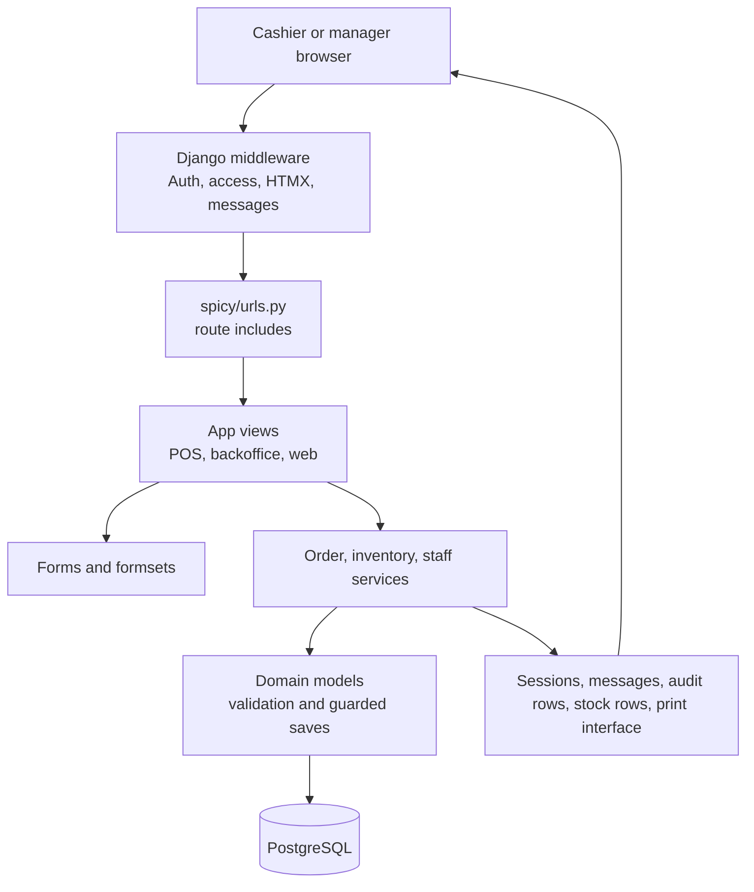

# Architecture Overview

## System Shape

Spicy is a Django monolith with server-rendered HTML. The cashier POS and manager backoffice share the same Django process, database, session store, templates, and domain services. HTMX replaces parts of the page. Alpine.js handles local UI state. There is no active REST API, React/Vue frontend, report app, customer app, or print-agent client in the current source tree.

## Project Boundaries

- `spicy/` contains settings, root URLs, and WSGI configuration. Settings load `.env` through django-environ: `SECRET_KEY` has no committed fallback (a missing key fails at boot), `DEBUG` defaults off, `ALLOWED_HOSTS` defaults to `localhost,127.0.0.1`, and the admin-lock bypass is an explicit `SPICY_DEV_ADMIN_BYPASS` opt-in. `spicy/settings_production.py` adds the TLS-only flags (SSL redirect, secure cookies, HSTS) for an HTTPS deployment.
- `apps/` contains the active project packages. They are top-level packages, never children of `spicy/`.
- `templates/` contains the shared web shell, backoffice pages, POS pages, auth pages, and inline Django partials.
- `assets/` contains Vite source JavaScript and CSS. `assets/javascript/site.js` is the main browser entry.
- `media/` contains uploaded item/profile media and the default item image.
- PostgreSQL is the source of truth for operational state.

## Runtime Request Lifecycle

1. Django loads `spicy.settings`, including the custom user model and app URLs.
2. `AuthenticationMiddleware` sets `request.user`. `LoginRequiredMiddleware` redirects anonymous requests to the login page unless the view is `@login_not_required`.
3. `HtmxMiddleware` exposes `request.htmx` to views and templates.
4. A route in `spicy/urls.py` selects a web, POS, or backoffice view.
5. Views parse request data, resolve records, and delegate multi-record changes to `apps.orders.services`, `apps.inventory.services`, or `apps.staff.services`.
6. Model methods validate snapshots, status transitions, money, stock lines, and relationship constraints.
7. The view renders a full page or a Django inline partial. HTMX replaces the requested target. `MessagesMiddleware` adds toast events where needed.

## URL Precedence Note

`spicy/urls.py` includes `apps.orders.pos_urls` at `/pos/`. The old shadowing `web:pos_index` route is gone; every caller reverses `pos:pos_home`.

## Business Logic Placement

- Order lifecycle, payment validation, drink reservation, ticket creation, and receipt-print logic: `apps/orders/services.py`.
- Order immutability, line snapshots, totals, and audit-event append rules: `apps/orders/models.py`.
- Stock posting, PWAC updates, reversal entries, and inventory document lifecycle: `apps/inventory/services.py` and `apps/inventory/models.py`.
- Shift opening/closing and payment reconciliation: `apps/staff/services.py` and `apps/staff/models.py`.
- Menu, settings, and payment master CRUD mostly uses forms and direct model saves from views.

## Infrastructure and Integrations

- PostgreSQL: configured in `spicy/settings.py:136-151`. Runs as a Docker service in `docker-compose.yml`.
- Authentication/email: django-allauth under `/accounts/`, Django email backend, and env-configured admin recipients.
- Sites: `apps/web/meta.py` and `apps/web/migrations/0001_initial.py`.
- Printing: `apps/orders/printing.py` currently returns a simulated success result. `ProductionUnit` stores printer settings, but no ESC/POS, HTTP, USB, LAN, or socket implementation exists.
- Assets: Vite writes manifest-backed output into `static/`. Development runs Django and Vite through `scripts/dev.sh`.

## Actual Scope Boundaries

The current code intentionally has no `apps/customers`, `apps/receipts`, or `apps/printing`. `apps/reports` owns the Daily P&L document and the query-based sales, POS register, general ledger, trial balance, and simple P&L reports. Customer grouping means `Order.guest_count` and `OrderItem.customer_index`. There is no customer master. Receipt/KOT printing is an orders abstraction, with no separate integration.
