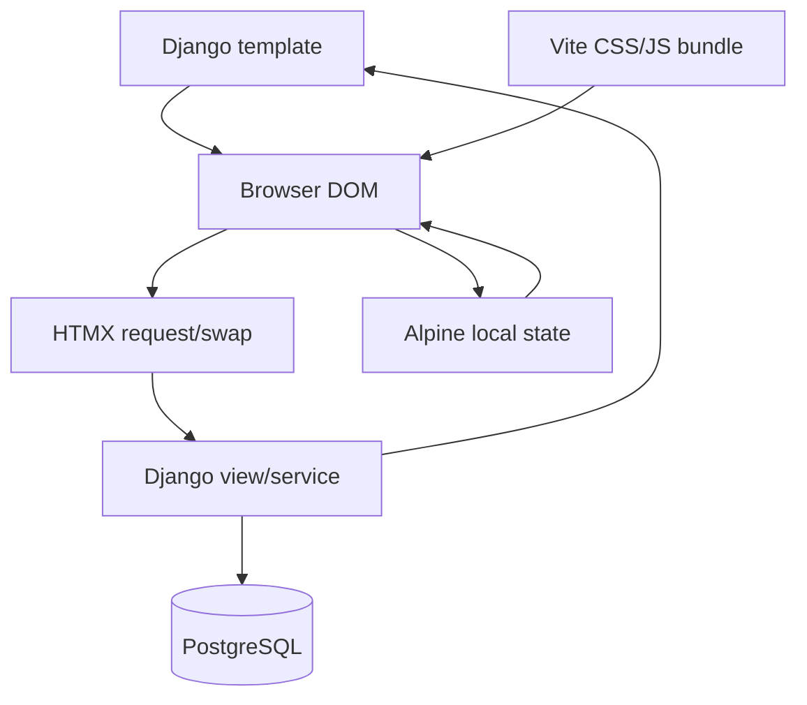

# Frontend Overview

## Rendering Model

The frontend is Django templates plus HTMX and Alpine.js. Vite bundles JavaScript/CSS but does not own page rendering. Django remains responsible for catalog data, cart HTML, totals, permissions, messages, and all business validation.

## Template Inheritance

- `templates/web/base.html`: shared application/public base, Vite CSS, CSRF headers, messages, and site JavaScript.
- `templates/web/public_base.html`: public sign-in/sign-up shell with the Spicy lockup in the navbar and footer.
- `templates/web/app/app_base.html`: backoffice navigation and `#app-content` target.
- `templates/pos/base.html`: full-height POS shell, user menu, POS navigation, and `#pos-main` target.
- `templates/pos/index.html`: POS surface with inline partials `surface`, `catalog_workspace`, and `cart`.

## POS DOM Surfaces

| Target | Server response | Main callers |
|---|---|---|
| `#pos-main` | full POS surface | navigation, home, history, close shift |
| `#cart-panel` | cart wrapper via `pos/index.html#cart` | add/update/meta/clear/ticket actions |
| `#catalog-workspace` | catalog workspace | search, category, special filters |
| `#catalog-grid` | out-of-band grid | cart mutations with `catalog_oob` |
| `#payment-dialog-container` | payment dialog | GET settle |
| `#catalog-dialog-container` | add-on and variant service dialogs | GET add-on/variant dialogs |
| `#order-details-drawer` | history drawer partial | history row/detail print |

## Backoffice Frontend

Most backoffice pages are full HTML responses extending `app_base.html`. HTMX is used selectively for staff role rows, destructive deletes, and inventory formset row add/remove. Alpine provides local select-driven visibility, compact filter popovers, and purpose-dependent form controls. Stock-entry, reconciliation, and purchase receipt submit/cancel actions use the shared confirmation dialog before posting or reversing a document. That dialog reads `data-confirm-*` attributes and renders them as text nodes. `searchable-select.js` initializes Tom Select on ordinary form selects after initial load and HTMX swaps.

## Asset Build

`vite.config.ts` builds the CSS bundles and the `site` JavaScript entry into `static/` with a manifest for django-vite. `site.js` imports HTMX, Alpine, drawer, logout, toast, confirmation, and searchable-select behavior.

## Frontend/Backend Authority

Client-side previews calculate opening/closing totals and payment entered totals for immediate feedback. The server recalculates totals, checks shifts, stock, permissions, and state transitions. Disabled buttons and hidden controls are presentation only. They are affordances, never authorization.
