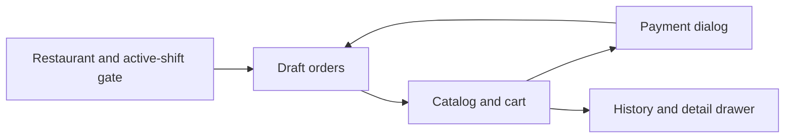

# POS Workflow

## Surface and Access

The active cashier surface is `apps/orders/views_pos.py`, mounted by `apps/orders/pos_urls.py` at `/pos/`. `@staff_required` in `apps/users/decorators.py` gates the views. Any Spicy role (Cashier included) passes. Others get 403. The POS shell is `templates/pos/base.html`. `#pos-main` is the main HTMX target.

## Shift Gate

`pos_home()` first calls `Restaurant.load()`. Missing settings produce the error gate. With settings, `_get_open_shift()` looks for `POSOpeningEntry.status=SUBMITTED` with no closing link. If none exists, the no-shift partial renders enabled payment modes and the opening form. Every order endpoint repeats the active-shift check. The UI gate is not the security boundary.

## Draft Orders

The home surface lists `Order.objects.open_drafts_for(shift, user)`. `services.open_draft_orders()` enriches it with ticket status, item preview, and age. A cashier sees only their own drafts (plus legacy rows with no creator). Manager/Admin see every draft on the shift. Every POS draft screen and mutation view uses the same filter, so a non-owner gets a 404 even with a direct URL. `create_draft_order()` enforces `Restaurant.max_open_drafts` against all shift drafts, under a Restaurant and shift row lock. Ownership cannot dodge the cap. The session stores the current order primary key and per-order active customer card.

## Catalog

`_build_order_context()` resolves `Restaurant.active_menu`, filters enabled `MenuItem` rows, groups them by `ItemGroup`, and applies search/group/special filters. Size-variant menu lines (`menu.ItemVariant`) collapse into one parent card showing the parent name and the `₦min – ₦max` range. Lines without a variant row stay flat. `drink_stock_available()` adds availability annotations for DRINKS. FOOD is not stock-gated. A parent card is unavailable only when all its variants are unavailable. Search matches parent names, variant names, and item codes. Search and filter controls request `pos_order_screen` and replace `#catalog-workspace`.

## Cart

Menu buttons either POST directly to `pos_order_add_item` or GET the add-on dialog. Parent variant cards GET the variant dialog (`pos_order_variant_dialog`). That dialog submits the chosen size to the same add-item endpoint with `variant_item_id`. It chains into the add-on dialog when the size has add-ons. Cart quantity controls POST to `pos_order_update_item`. Guest/order-type controls POST to `pos_order_update_meta`. The server locks order edits after a KOT is created, even if a stale browser sends a request. Cart responses replace `#cart-panel`. Successful mutations can refresh `#catalog-grid` out of band.

## Send, Pay, Cancel, Discard

- Send to kitchen creates department-specific immutable KOT/BOT snapshots and dispatches each ticket independently.
- Pay loads a dialog. Settlement then validates full payment, shift ownership, payment modes, required electronic references, current item availability, and stock before submitting the order.
- Cancel is available for sent/printed unpaid drafts. It preserves the order and sends cancellation tickets.
- Discard is only for an empty untouched draft.
- Receipt printing claims the order as printed before calling the print interface, which intentionally locks further draft edits.

## History

`pos_order_history()` defaults to current-date submitted paid non-return sales. Manager/admin/superuser users, or any user when `Restaurant.pos_allow_full_history=True`, can request all/returns/cancelled/discarded filters. Rows load `pos_order_history_detail()` into `#order-details-drawer`. Alpine controls focus and animation. It never controls business state. Detail and receipt reprint enforce the same visibility. Without full history, only submitted paid non-return orders resolve (others 404). With full history, cancelled and discarded orders are viewable, and any submitted receipt is reprintable.

## Important Current Gaps

- There is no customer master or customer selection workflow. `customer_name` remains a text field, and guest cards are order-local indices.
- Settlement auto-prints the receipt after commit. A printer failure warns but never blocks the sale.
- Return drafts are created and submitted in backoffice. Submission restores drink stock and mirrors refund rows.
- Printing is simulated by `apps/orders/printing.py`.
- The payment dialog may show an enabled mapped mode that was not declared at shift opening. Settlement rejects it server-side.
